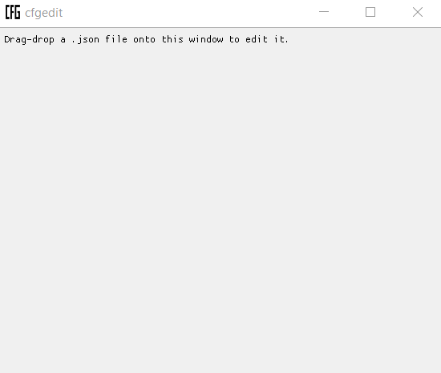

# cfgedit

Simple JSON config file editor built from [RapidJSON][rapidjson] and [Dear ImGUI][imgui].



[Get it here](https://github.com/nathanrw/cfgedit/releases/download/v0.0.1/cfgedit.exe)

## Usage and limitations

`cfgedit` can edit existing values in JSON files but cannot e.g. add items to
arrays or members to objects.

Crude heuristics are used to identify structured data. At the moment, this means
that array members with names that end in 'colour' or 'color' and which have the
right structure can be interpreted as colours.

The program is probably unsuitable for large files; at present it has only been
tried with small, simple files.

DPI scaling doesn't work. On Windows, if you have a high-DPI screen, you might
need to enable Windows 8 compatibilty to have the OS stretch the window for you.

It has only been built on Windows and may need tweaking to work on other
platforms.

## Building

```Bash
git clone https://github.com/nathanrw/cfgedit
git submodule update --init --recursive
cd cfgedit
mkdir _build
cd _build
cmake ..
cmake --build . --target cfgedit
# or start the IDE project
```

[rapidjson]: https://github.com/Tencent/rapidjson
[imgui]: https://github.com/ocornut/imgui